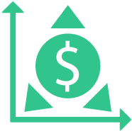

<!-- Improved compatibility of back to top link: See: https://github.com/othneildrew/Best-README-Template/pull/73 -->
<a name="readme-top"></a>


<!-- PROJECT LOGO -->
<br />
<div align="center">
  <a href="https://portfolio-dashboard.syedtaqihaider.co.uk">
    
  </a>

<h3 align="center">Build-a-portfolio</h3>

  <p align="center">
    An open-source web app that helps beginners learn the basics of
    investing. 
    <br />
    Learn how to build a portfolio, analyse assets and more.
    <br />
    <a href="https://github.com/syedtaqi95/portfolio-dashboard"><strong>Explore the docs »</strong></a>
    <br />
    <br />
    <a href="https://portfolio-dashboard.syedtaqihaider.co.uk">View App</a>
    ·
    <a href="https://github.com/syedtaqi95/portfolio-dashboard/issues">Report Bug</a>
    ·
    <a href="https://github.com/syedtaqi95/portfolio-dashboard/issues">Request Feature</a>
  </p>
</div>


<!-- TABLE OF CONTENTS -->
<details>
  <summary>Table of Contents</summary>
  <ol>
    <li>
      <a href="#about-the-project">About The Project</a>
      <ul>
        <li><a href="#built-with">Built With</a></li>
      </ul>
    </li>
    <li>
      <a href="#getting-started">Getting Started</a>
      <ul>
        <li><a href="#prerequisites">Prerequisites</a></li>
        <li><a href="#installation">Installation</a></li>
      </ul>
    </li>
    <li><a href="#usage">Usage</a></li>
    <li><a href="#roadmap">Roadmap</a></li>
    <li><a href="#contributing">Contributing</a></li>
    <li><a href="#license">License</a></li>
    <li><a href="#contact">Contact</a></li>
  </ol>
</details>


<!-- ABOUT THE PROJECT -->
## About The Project

<!-- [![Portfolio Dashboard Screen Shot][product-screenshot]](https://portfolio-dashboard.syedtaqihaider.co.uk) -->

🤔 When I began my investing journey in 2019, I found that most online
tools and resources to learn investing were not friendly to beginners.
They often assumed prior financial knowledge and used fancy letters and 
words (sometimes even in Greek!) without explanation.

💡 I wanted to help democratise financial literacy, and I thought that
there is no better way of doing that than building my own project to share
my own learning with the online community. And so my idea was born! Now I
just had to build it...

🧑‍🎓 This web app uses a "learn-by-doing" approach to teach you:

* What are the different asset classes (stocks, bonds, real estate, commodities, etc.)
* How to build a portfolio
* How to analyse a portfolio (risk, returns etc.)

<p align="right">(<a href="#readme-top">back to top</a>)</p>


### Built With

* [![React][React.js]][React-url]
* [![AWS Lambda][AWS Lambda]][AWS-Lambda-url]
* [![Github][Github]][Github-url]
* [![Terraform][Terraform]][Terraform-url]


<p align="right">(<a href="#readme-top">back to top</a>)</p>


<!-- GETTING STARTED -->
## Getting Started

This is an example of how you may give instructions on setting up your project locally.
To get a local copy up and running follow these simple example steps.

### Prerequisites

This is an example of how to list things you need to use the software and how to install them.
* npm
  ```sh
  npm install npm@latest -g
  ```

### Installation

1. Get a free API Key at [https://example.com](https://example.com)
2. Clone the repo
   ```sh
   git clone https://github.com/syedtaqi95/portfolio-dashboard.git
   ```
3. Install NPM packages
   ```sh
   npm install
   ```
4. Enter your API in `config.js`
   ```js
   const API_KEY = 'ENTER YOUR API';
   ```

<p align="right">(<a href="#readme-top">back to top</a>)</p>


<!-- USAGE EXAMPLES -->
## Usage

Use this space to show useful examples of how a project can be used. Additional screenshots, code examples and demos work well in this space. You may also link to more resources.

_For more examples, please refer to the [Documentation](https://example.com)_

<p align="right">(<a href="#readme-top">back to top</a>)</p>


<!-- ROADMAP -->
## Roadmap

- [ ] Feature 1
- [ ] Feature 2
- [ ] Feature 3
    - [ ] Nested Feature

See the [open issues](https://github.com/syedtaqi95/portfolio-dashboard/issues) for a full list of proposed features (and known issues).

<p align="right">(<a href="#readme-top">back to top</a>)</p>


<!-- CONTRIBUTING -->
## Contributing

Contributions are what make the open source community such an amazing place to learn, inspire, and create. Any contributions you make are **greatly appreciated**.

If you have a suggestion that would make this better, please fork the repo and create a pull request. You can also simply open an issue with the tag "enhancement".
Don't forget to give the project a star! Thanks again!

1. Fork the Project
2. Create your Feature Branch (`git checkout -b feature/AmazingFeature`)
3. Commit your Changes (`git commit -m 'Add some AmazingFeature'`)
4. Push to the Branch (`git push origin feature/AmazingFeature`)
5. Open a Pull Request

<p align="right">(<a href="#readme-top">back to top</a>)</p>


<!-- LICENSE -->
## License

Distributed under the MIT License. See `LICENSE.txt` for more information.

<p align="right">(<a href="#readme-top">back to top</a>)</p>


<!-- CONTACT -->
## Contact

Your Name - [syed.taqi95@gmail.com](syed.taqi95@gmail.com)

Project Link: [https://github.com/syedtaqi95/portfolio-dashboard](https://github.com/syedtaqi95/portfolio-dashboard)

<p align="right">(<a href="#readme-top">back to top</a>)</p>


<!-- MARKDOWN LINKS & IMAGES -->
<!-- https://www.markdownguide.org/basic-syntax/#reference-style-links -->
[contributors-shield]: https://img.shields.io/github/contributors/syedtaqi95/portfolio-dashboard.svg?style=for-the-badge
[contributors-url]: https://github.com/syedtaqi95/portfolio-dashboard/graphs/contributors
[forks-shield]: https://img.shields.io/github/forks/syedtaqi95/portfolio-dashboard.svg?style=for-the-badge
[forks-url]: https://github.com/syedtaqi95/portfolio-dashboard/network/members
[stars-shield]: https://img.shields.io/github/stars/syedtaqi95/portfolio-dashboard.svg?style=for-the-badge
[stars-url]: https://github.com/syedtaqi95/portfolio-dashboard/stargazers
[issues-shield]: https://img.shields.io/github/issues/syedtaqi95/portfolio-dashboard.svg?style=for-the-badge
[issues-url]: https://github.com/syedtaqi95/portfolio-dashboard/issues
[license-shield]: https://img.shields.io/github/license/syedtaqi95/portfolio-dashboard.svg?style=for-the-badge
[license-url]: https://github.com/syedtaqi95/portfolio-dashboard/blob/master/LICENSE.txt
[linkedin-shield]: https://img.shields.io/badge/-LinkedIn-black.svg?style=for-the-badge&logo=linkedin&colorB=555
[linkedin-url]: https://linkedin.com/in/syedtaqi-haider
[product-screenshot]: images/screenshot.png
[React.js]: https://img.shields.io/badge/React-20232A?style=for-the-badge&logo=react&logoColor=61DAFB
[React-url]: https://reactjs.org/
[AWS Lambda]: https://img.shields.io/badge/AWS%20Lambda-grey?style=for-the-badge&logo=awslambda&logoColor=#FF9900
[AWS-Lambda-url]: https://aws.amazon.com/
[Github]: https://img.shields.io/badge/GitHub%20Actions-white?style=for-the-badge&logo=github&logoColor=181717
[Github-url]: https://github.com/features/actions
[Terraform]: https://img.shields.io/badge/Terraform-lightgrey?style=for-the-badge&logo=terraform&logoColor=7B42BC
[Terraform-url]: https://www.terraform.io/